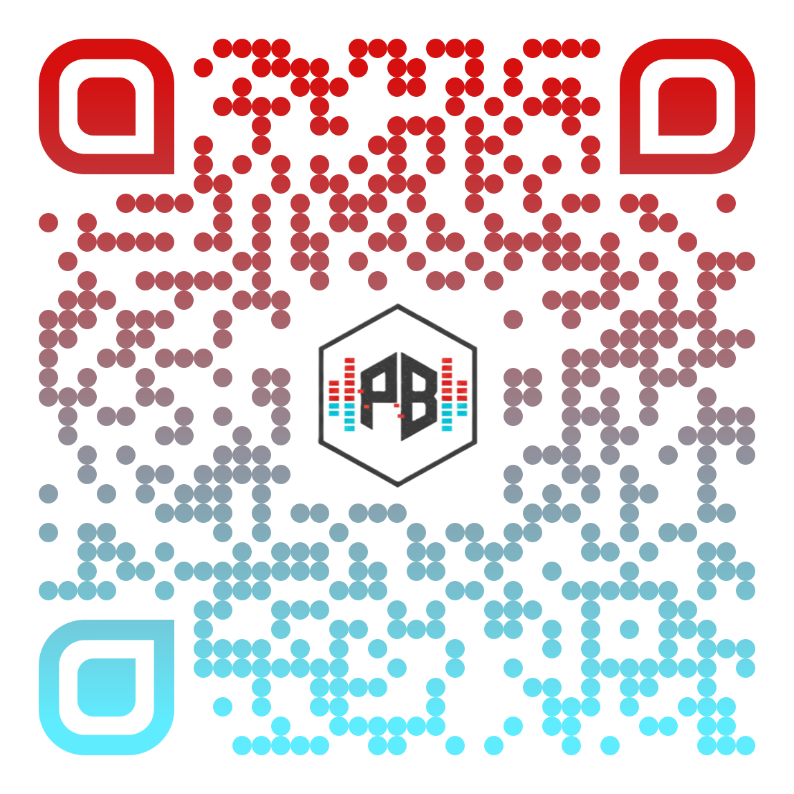

<p align="center">

  

</p>


# PROGRES:BEAT // UNIT_11

### INDUSTRIAL CYBERDECK CONTROL INTERFACE // REV 3.0


> **PROGRES:BEAT** is a specialized hardware-software artifact designed for "Deep Work" environments. It functions as a standalone industrial-grade visualizer and processing indicator, driven by a low-latency Web Bluetooth protocol to an 11-pixel LED ring array.


---


## 1. TECHNICAL SPECIFICATIONS


### 1.1 Hardware Architecture

| Component | Specification | Description |

| :--- | :--- | :--- |

| **Microcontroller** | ATmega328P | Arduino Uno R3 Core |

| **Connectivity** | Bluetooth 2.0/4.0 | HC-05 / HM-10 Module |

| **Visual Output** | WS2812B RGB Ring | 11 Addressable Pixels |

| **Audio Feedback**| Active Buzzer | 5V TTL Logic |

| **Power Logic** | USB 5V | 500mA Bus Powered |


### 1.2 Wiring Interface (PINOUT)

**Strict adherence to this configuration is mandatory for Firmware V3 compatibility:**


| Peripheral | Signal | Arduino Pin |

| :--- | :--- | :--- |

| **BUZZER** | I/O SIGNAL | **D2** |

| **LED RING** | DATA LINE | **D3** |

| **BT MODULE** | STATE | **D4** |

| **BT MODULE** | TXD (Transmit) | **D9** |

| **BT MODULE** | RXD (Receive) | **D10** |


---


## 2. MECHANICAL SYSTEM & ASSEMBLY
Visual representation of the working unit

<p align="center">
  
  <br>
  <em>Fig 1.0: Working prototype of UNIT_11</em>
</p>


---


## 3. OPERATIONAL LOGIC


The system operates on a dual-mode communication protocol via Bluetooth UART at 9600 baud.


* **SYNC MODE (Command: 'V'):** Real-time frequency-to-pixel mapping. Accepts integer values (0-11) to represent signal amplitude.

* **LOADING MODE (Command: 'L'):** Triggers an autonomous "Comet" animation stored in the MCU firmware.


---


## 4. DESIGN SYSTEM & IDENTITY


### 4.1 Industrial Color Palette

The artifact utilizes a specific color-coding system for data representation:

* **CRIMSON RED (`#C70039`):** High-intensity signals, peaks, and system alerts.

* **CYBER BLUE (`#2196F3`):** Connectivity status, idle data flow, and UI elements.

* **TERMINAL WHITE (`#E0E0E0`):** Default state, secondary visualization, and typography.


---


## 5. FIRMWARE SOURCE CODE (V3.0)


```cpp

/*

 * PROGRES:BEAT // UNIT_11 FIRMWARE

 * REV: 3.0.0 // 2026-01-21

 */


#include <Adafruit_NeoPixel.h>

#include <SoftwareSerial.h>


#define LED_PIN    3

#define BUZZER_PIN 2

#define BT_RX      10

#define BT_TX      9

#define NUMPIXELS  11


Adafruit_NeoPixel pixels(NUMPIXELS, LED_PIN, NEO_GRB + NEO_KHZ800);

SoftwareSerial BTSerial(BT_RX, BT_TX);


void setup() {

  pixels.begin();

  pixels.setBrightness(40);

  pinMode(BUZZER_PIN, OUTPUT);

  BTSerial.begin(9600);

  

  // Power-on Self Test (POST)

  digitalWrite(BUZZER_PIN, HIGH);

  delay(50);

  digitalWrite(BUZZER_PIN, LOW);

}


void loop() {

  if (BTSerial.available() > 0) {

    char cmd = BTSerial.read();

    

    if (cmd == 'V') {

      int level = BTSerial.parseInt();

      updateRing(level);

    } else if (cmd == 'L') {

      loadingAnimation();

    }

  }

}


void updateRing(int n) {

  pixels.clear();

  for(int i=0; i<n; i++) {

    pixels.setPixelColor(i, pixels.Color(0, 150, 255)); // Cyber Blue

  }

  pixels.show();

}


void loadingAnimation() {

  for(int j=0; j<3; j++) {

    for(int i=0; i<NUMPIXELS; i++) {

      pixels.clear();

      pixels.setPixelColor(i, pixels.Color(224, 224, 224)); // Terminal White

      pixels.show();

      delay(60);

    }

  }

}
